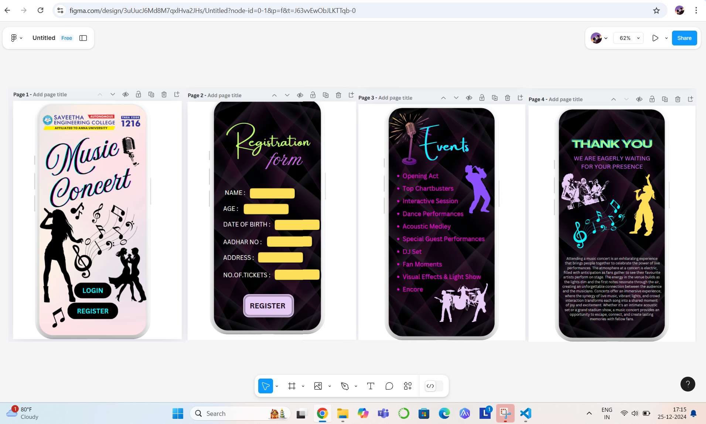

# Ex09 Event Registration Web Application
## Date: 24.12.2024

## AIM:
To design, develop and deploy a web application for event registration.

## DESIGN STEPS:

### Step 1:
Create a new frame.

### Step 2:
Select any one preset size of your choice.

### Step 3:
Select the shapes you need.

### Step 4:
Import images as needed.

### Step 5:
Create pages based on your need and link them.

### Step 6:

Validate the HTML and CSS code.

### Step 6:

Publish the website in the given URL.

## DESIGN TOOL:
Figma

## CODE:
```
Home page

<!DOCTYPE html>
<html lang="en">
<head>
  <meta charset="UTF-8">
  <meta name="viewport" content="width=device-width, initial-scale=1.0">
  <title>Music Concert</title>
  <style>
    body {
      font-family: Arial, sans-serif;
      margin: 0;
      padding: 0;
      background: linear-gradient(to bottom, #fdf1f1, #ffffff);
      display: flex;
      justify-content: center;
      align-items: center;
      height: 100vh;
    }

    .container {
      width: 360px;
      background: #fff;
      border-radius: 20px;
      box-shadow: 0 4px 6px rgba(0, 0, 0, 0.1);
      text-align: center;
      padding: 20px;
    }

    .header img {
      width: 80px;
    }

    .header h1 {
      font-size: 18px;
      margin: 10px 0 5px;
    }

    .header p {
      font-size: 14px;
      color: #666;
    }

    .concert-title {
      font-size: 30px;
      font-weight: bold;
      color: #e91e63;
      margin: 20px 0;
      text-shadow: 1px 1px 2px rgba(0, 0, 0, 0.2);
    }

    .icons {
      position: relative;
      margin: 20px 0;
    }

    .icons img {
      width: 50px;
      height: auto;
      margin: 0 10px;
    }

    .silhouettes {
      display: flex;
      justify-content: space-evenly;
      margin-top: 20px;
    }

    .buttons {
      margin-top: 20px;
    }

    .buttons button {
      width: 150px;
      padding: 10px;
      margin: 10px;
      font-size: 16px;
      font-weight: bold;
      color: #fff;
      background: #000;
      border: none;
      border-radius: 5px;
      cursor: pointer;
    }

    .buttons button:hover {
      background: #555;
    }

    .buttons .register {
      background: #2196f3;
    }

    .buttons .register:hover {
      background: #1769aa;
    }
  </style>
</head>
<body>
  <div class="container">
    <div class="header">
      <h1>SAVEETHA ENGINEERING COLLEGE</h1>
      <p>Affiliated to Anna University</p>
      <p>TNEA CODE: 1216</p>
    </div>
    <div class="concert-title">Music Concert</div>
    <div class="icons">
      
    </div>
    <div class="silhouettes">
      
      
    </div>
    <div class="buttons">
      <button class="login">LOGIN</button>
      <button class="register">REGISTER</button>
    </div>
  </div>
</body>
</html>

Register page

<!DOCTYPE html>
<head>
  <meta charset="UTF-8">
  <meta name="viewport" content="width=device-width, initial-scale=1.0">
  <title>Registration Page</title>
  <link rel="stylesheet" href="styles.css">
</head>
<body>
  <div class="container">
    <div class="form-container">
      <h1>Event Registration</h1>
      <form action="/submit" method="POST">
        <div class="form-group">
          <label for="name">Full Name</label>
          <input type="text" id="name" name="name" required>
        </div>
        <div class="form-group">
          <label for="age">Age</label>
          <input type="number" id="age" name="age" min="1" required>
        </div>
        <div class="form-group">
          <label for="address">Address</label>
          <textarea id="address" name="address" rows="3" required></textarea>
        </div>
        <div class="form-group">
          <label for="dob">Date of Birth</label>
          <input type="date" id="dob" name="dob" required>
        </div>
        <div class="form-group">
          <label for="tickets">Number of Tickets</label>
          <input type="number" id="tickets" name="tickets" min="1" required>
        </div>
        <button type="submit">Register</button>
      </form>
    </div>
  </div>
</body>
</html>

body {
  font-family: Arial, sans-serif;
  margin: 0;
  padding: 0;
  background-color: #f4f4f9;
  display: flex;
  justify-content: center;
  align-items: center;
  height: 100vh;
}

/* Container */
.container {
  width: 100%;
  max-width: 400px;
  background: #fff;
  border-radius: 8px;
  box-shadow: 0 4px 6px rgba(0, 0, 0, 0.1);
  padding: 20px;
}

/* Form Container */
.form-container h1 {
  text-align: center;
  margin-bottom: 20px;
  font-size: 24px;
  color: #333;
}

.form-group {
  margin-bottom: 15px;
}

label {
  display: block;
  margin-bottom: 5px;
  color: #555;
}

input, textarea {
  width: 100%;
  padding: 10px;
  border: 1px solid #ccc;
  border-radius: 5px;
  font-size: 14px;
}

textarea {
  resize: none;
}

button {
  width: 100%;
  padding: 10px;
  background-color: #007BFF;
  color: #fff;
  border: none;
  border-radius: 5px;
  font-size: 16px;
  cursor: pointer;
}

button:hover {
  background-color: #0056b3;
}

/* Responsive Design */
@media (max-width: 480px) {
  .container {
    padding: 15px;
  }
}

event page:

<!DOCTYPE html>
<html lang="en">
<head>
  <meta charset="UTF-8">
  <meta name="viewport" content="width=device-width, initial-scale=1.0">
  <title>Music Concert Events</title>
  <style>
    body {
      font-family: Arial, sans-serif;
      margin: 0;
      padding: 0;
      background: linear-gradient(to bottom, #1c1c1c, #000);
      display: flex;
      justify-content: center;
      align-items: center;
      height: 100vh;
    }

    .container {
      width: 360px;
      background: #000;
      border-radius: 20px;
      box-shadow: 0 4px 6px rgba(0, 0, 0, 0.5);
      text-align: center;
      padding: 20px;
      color: #fff;
      position: relative;
    }

    .background {
      background: radial-gradient(circle, #2c2c2c, #000);
      height: 100%;
      width: 100%;
      position: absolute;
      top: 0;
      left: 0;
      z-index: 1;
      border-radius: 20px;
      opacity: 0.9;
    }

    .content {
      position: relative;
      z-index: 2;
    }

    .title {
      font-size: 36px;
      font-weight: bold;
      color: #ff00ff;
      margin-bottom: 20px;
      text-shadow: 0 0 5px #ff00ff, 0 0 10px #ff00ff;
    }

    .event-list {
      list-style: none;
      padding: 0;
      margin: 0;
      font-size: 18px;
      color: #ff66ff;
      text-align: left;
    }

    .event-list li {
      margin: 10px 0;
      padding-left: 20px;
      position: relative;
    }

    .event-list li:before {
      content: "•";
      color: #ff66ff;
      position: absolute;
      left: 0;
    }

    .silhouettes {
      display: flex;
      justify-content: center;
      gap: 10px;
      margin-top: 20px;
    }

    .silhouettes img {
      width: 80px;
      height: auto;
    }
  </style>
</head>
<body>
  <div class="container">
    <div class="background"></div>
    <div class="content">
      <div class="title">Events</div>
      <ul class="event-list">
        <li>Opening Act</li>
        <li>Top Chartbusters</li>
        <li>Interactive Session</li>
        <li>Dance Performances</li>
        <li>Acoustic Medley</li>
        <li>Special Guest Performances</li>
        <li>DJ Set</li>
        <li>Fan Moments</li>
        <li>Visual Effects & Light Show</li>
        <li>Encore</li>
      </ul>
      <div class="silhouettes">
        
        
        
      </div>
    </div>
  </div>
</body>
</html>


thank page:

[6:01 pm, 25/12/2024] Silambu 👻😇: <!DOCTYPE html>
<html lang="en">
<head>
  <meta charset="UTF-8">
  <meta name="viewport" content="width=device-width, initial-scale=1.0">
  <link rel="stylesheet" href="styles.css">
  <title>Music Concert Invitation</title>
</head>
<body>
  <div class="card">
    <div class="content">
      <h1>THANK YOU</h1>
      <h2>WE ARE EAGERLY WAITING FOR YOUR PRESENCE</h2>
      <div class="images">
        
        
        <div class="music-notes">
          &#9835; &#9833; &#9836; &#9834;
        </div>
      </div>
      <p>
        Attending a music concert is an exhilarating experience that brings people together to celebrate the power of live performances. The atmosphere at a concert is electric, filled with anticipation as fans gather to see their favourite artists perform on stage. The energy in the venue builds as the lights dim and the first notes resonate through the air, creating an unforgettable connection between the audience and the musicians. Concerts offer an immersive experience, where the synergy of live music, vibrant lights, and crowd interaction transforms each song into a shared moment of joy and excitement. Whether it's an intimate acoustic set or a grand stadium show, a music concert provides an opportunity to escape, connect, and create lasting memories with fellow fans.
      </p>
    </div>
  </div>
</body>
</html>
[6:02 pm, 25/12/2024] Silambu 👻😇: /* styles.css */
body {
  margin: 0;
  font-family: Arial, sans-serif;
  background-color: #000;
  display: flex;
  justify-content: center;
  align-items: center;
  height: 100vh;
}

.card {
  width: 90%;
  max-width: 400px;
  background: linear-gradient(135deg, #1a1a1a, #2e2e2e);
  border-radius: 20px;
  color: #fff;
  padding: 20px;
  box-shadow: 0 4px 20px rgba(0, 0, 0, 0.5);
}

.content h1 {
  font-size: 2.5rem;
  text-align: center;
  color: #00ffcc;
  margin-bottom: 10px;
  text-shadow: 2px 2px 5px #000;
}

.content h2 {
  font-size: 1.2rem;
  text-align: center;
  color: #ffc107;
  margin-bottom: 20px;
}

.images {
  text-align: center;
  margin-bottom: 20px;
  position: relative;
}

.band-icon,
.singer-icon {
  width: 70px;
  margin: 10px;
}
.music-notes {
  font-size: 2rem;
  color: #00ffcc;
}

.content p {
  font-size: 0.9rem;
  line-height: 1.5;
  text-align: justify;
  color: #dcdcdc;
}

```

## OUTPUT:



## RESULT:

The program to design, develop and deploy a web application for event registration is completed successfully.
